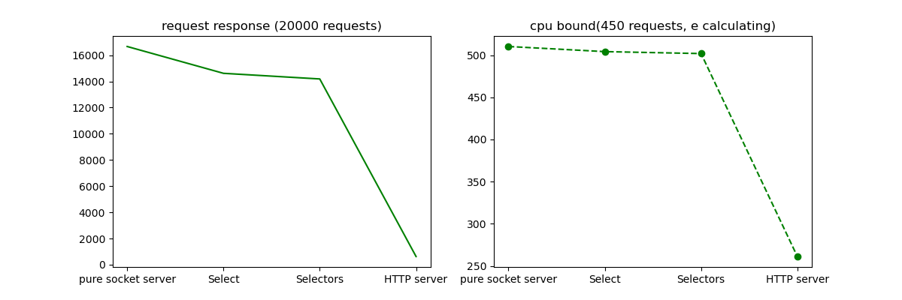

# Server request response comparing

## CPU bound task - calculating the number e using the series

```
def cpu_bound_func(accuracy = 20):
    def exp(acc):
        def factorial(n):
            if n == 0:
                return 1
            else:
                return n * factorial(n-1)
        e = 0
        for x in range(accuracy):
            e += 1/factorial(x)
        return e
    return exp(accuracy)
```

## Result table

|               | request response | CPU bound |
| ------------- | ------------- |--------------|
|socket server  | 16668.84      | 510.24       |
|Select         | 14620.01      |  504.18      |
|Selectors      | 14189.49      | 501.85       |
|Flask server   | 626.49        | 261.15       |
=

## comparative charts graphics



- [About](#about)
- [Getting Started](#getting_started)
- [Usage](#usage)
- [Contributing](../CONTRIBUTING.md)

## About <a name = "about"></a>

Write about 1-2 paragraphs describing the purpose of your project.

## Getting Started <a name = "getting_started"></a>

These instructions will get you a copy of the project up and running on your local machine for development and testing purposes. See [deployment](#deployment) for notes on how to deploy the project on a live system.

### Prerequisites

What things you need to install the software and how to install them.

```
Give examples
```

### Installing

A step by step series of examples that tell you how to get a development env running.

Say what the step will be

```
Give the example
```

And repeat

```
until finished
```

End with an example of getting some data out of the system or using it for a little demo.

## Usage <a name = "usage"></a>

Add notes about how to use the system.
