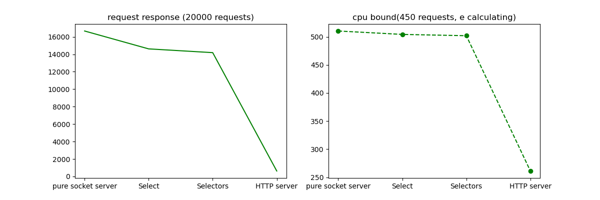

# Server request response comparing

## CPU bound task - calculating the number e using the series

```
def cpu_bound_func(accuracy = 20):
    def exp(acc):
        def factorial(n):
            if n == 0:
                return 1
            else:
                return n * factorial(n-1)
        e = 0
        for x in range(accuracy):
            e += 1/factorial(x)
        return e
    return exp(accuracy)
```

## Result table

|               | request response | CPU bound |
| ------------- | ------------- |--------------|
|socket server  | 16668.84      | 510.24       |
|Select         | 14620.01      |  504.18      |
|Selectors      | 14189.49      | 501.85       |
|Flask server   | 626.49        | 261.15       |
=

## comparative charts graphics



